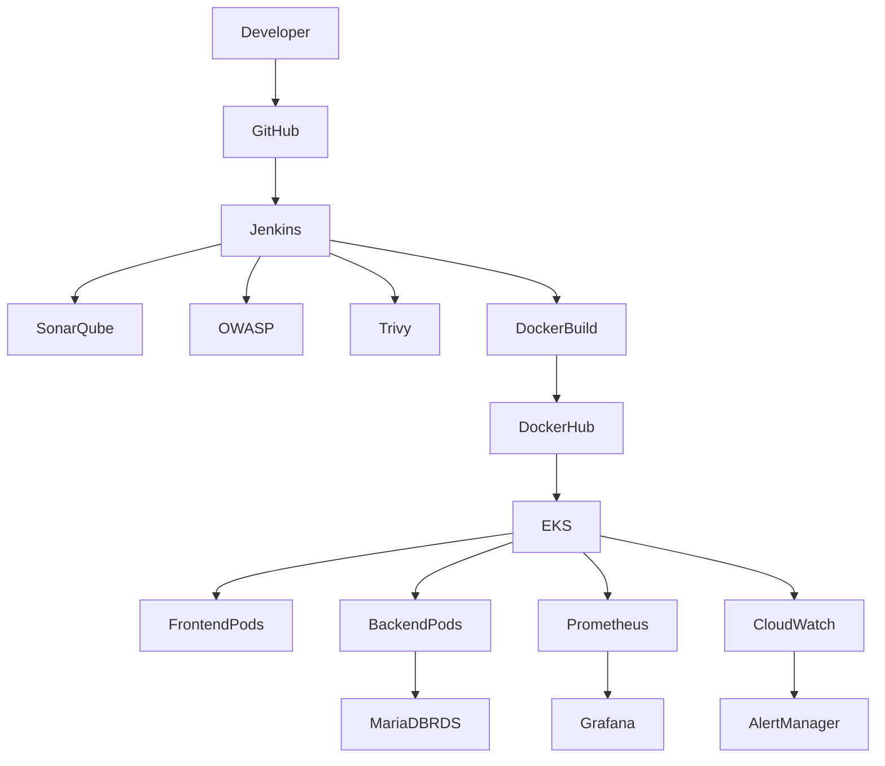
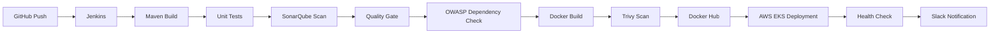

# Student Registration Enterprise DevOps Platform

## Overview

The Student Registration Enterprise DevOps Platform is a cloud-native application designed to manage student registration and profile information. The project demonstrates enterprise-grade DevOps practices by integrating CI/CD automation, Infrastructure as Code (IaC), containerization, Kubernetes orchestration, DevSecOps security controls, monitoring, and observability.

This project is built as a complete end-to-end DevOps implementation using AWS, Jenkins, Terraform, Docker, Kubernetes, Prometheus, Grafana, and CloudWatch.

---

## Business Problem

Traditional application deployments are often:

* Manual and time-consuming
* Difficult to scale
* Error-prone during releases
* Lacking centralized monitoring
* Missing automated security validation

These challenges increase operational overhead and reduce deployment reliability.

---

## Solution

The Student Registration application has been transformed into a fully automated cloud-native platform that provides:

* Automated CI/CD pipeline
* Infrastructure provisioning using Terraform
* Containerized deployments using Docker
* Kubernetes orchestration using AWS EKS
* DevSecOps implementation using SonarQube, OWASP, and Trivy
* Centralized monitoring and alerting
* Scalable and highly available architecture

---

# Architecture



---

# CI/CD Pipeline



---

# Technology Stack

| Category               | Technology             |
| ---------------------- | ---------------------- |
| Frontend               | React (Vite)           |
| Backend                | Spring Boot            |
| Database               | MariaDB                |
| Cloud Provider         | AWS                    |
| Source Control         | GitHub                 |
| CI/CD                  | Jenkins                |
| Infrastructure as Code | Terraform              |
| Containerization       | Docker                 |
| Container Registry     | Docker Hub             |
| Orchestration          | Kubernetes             |
| Managed Kubernetes     | AWS EKS                |
| Monitoring             | Prometheus             |
| Visualization          | Grafana                |
| Logging                | CloudWatch             |
| Security               | SonarQube              |
| Dependency Scanning    | OWASP Dependency Check |
| Image Scanning         | Trivy                  |
| Package Management     | Helm                   |

---

# Repository Structure

```text
Student-Registration-Enterprise/

├── frontend/
├── backend/

├── jenkins/
│   └── Jenkinsfile

├── terraform/
│   ├── modules/
│   │   ├── vpc/
│   │   ├── eks/
│   │   ├── rds/
│   │   ├── iam/
│   │   └── route53/
│   │
│   ├── environments/
│   │   └── prod/
│   │
│   ├── providers.tf
│   ├── backend.tf
│   ├── variables.tf
│   ├── outputs.tf
│   └── main.tf

├── kubernetes/
│   ├── frontend/
│   ├── backend/
│   ├── ingress/
│   ├── configmaps/
│   ├── secrets/
│   ├── hpa/
│   └── rbac/

├── helm/
│   └── student-registration-chart/

├── monitoring/
│   ├── prometheus/
│   ├── grafana/
│   ├── alertmanager/
│   └── cloudwatch/

├── security/
│   ├── trivy/
│   ├── owasp/
│   ├── kubesec/
│   └── policies/

├── diagrams/

├── scripts/

└── README.md
```

---

# Features

* Student Registration Management
* Student Profile Management
* CRUD Operations
* Containerized Deployment
* Automated CI/CD Pipeline
* Infrastructure as Code
* Kubernetes Auto Scaling
* Centralized Monitoring
* Automated Security Scanning
* Cloud-Native Deployment

---

# Prerequisites

Install the following tools:

```text
Git
Docker
Java 17
Maven
NodeJS
Terraform
AWS CLI
kubectl
Helm
Jenkins
```

---

# Local Setup

## Clone Repository

```bash
git clone https://github.com/yourusername/student-registration-enterprise.git

cd student-registration-enterprise
```

## Backend Setup

```bash
cd backend

mvn clean package

java -jar target/*.jar
```

Backend URL

```text
http://localhost:8080
```

## Frontend Setup

```bash
cd frontend

npm install

npm run build

npm run dev
```

Frontend URL

```text
http://localhost:5173
```

---

# Docker Deployment

## Build Images

```bash
docker build -t student-registration-frontend ./frontend

docker build -t student-registration-backend ./backend
```

## Run Containers

```bash
docker run -d -p 3000:80 student-registration-frontend

docker run -d -p 8080:8080 student-registration-backend
```

Verify:

```bash
docker ps
```

---

# Docker Hub

Push Images

```bash
docker tag student-registration-frontend anuragpatil/student-registration-frontend:latest

docker tag student-registration-backend anuragpatil/student-registration-backend:latest

docker push anuragpatil/student-registration-frontend:latest

docker push anuragpatil/student-registration-backend:latest
```

---

# Jenkins CI/CD

Pipeline Stages

1. Git Checkout
2. Maven Build
3. Unit Testing
4. SonarQube Analysis
5. Quality Gate Validation
6. OWASP Dependency Check
7. Docker Build
8. Trivy Security Scan
9. Docker Hub Push
10. AWS EKS Deployment
11. Rollout Validation
12. Health Check
13. Slack Notification

Pipeline File

```text
jenkins/Jenkinsfile
```

---

# Infrastructure Provisioning

Terraform provisions:

* VPC
* Public Subnets
* Private Subnets
* Internet Gateway
* NAT Gateway
* Route Tables
* Security Groups
* IAM Roles
* EKS Cluster
* Managed Node Groups
* MariaDB RDS
* Route53
* S3 Backend

Deploy:

```bash
cd terraform

terraform init

terraform validate

terraform plan

terraform apply -auto-approve
```

---

# Kubernetes Deployment

Deploy Resources

```bash
kubectl apply -f kubernetes/
```

Verify

```bash
kubectl get all -n student-registration
```

Resources:

* Frontend Deployment
* Backend Deployment
* Services
* Ingress
* HPA
* ConfigMaps
* Secrets
* RBAC

---

# Helm Deployment

Install Chart

```bash
helm install student-registration helm/student-registration-chart
```

Upgrade Chart

```bash
helm upgrade student-registration helm/student-registration-chart
```

Rollback

```bash
helm rollback student-registration 1
```

---

# Monitoring & Observability

Monitoring Stack:

* Prometheus
* Grafana
* AlertManager
* CloudWatch

Install Monitoring

```bash
helm repo add prometheus-community https://prometheus-community.github.io/helm-charts

helm install monitoring prometheus-community/kube-prometheus-stack
```

Metrics Collected:

* CPU Usage
* Memory Usage
* Pod Health
* Node Health
* Application Metrics

---

# Security Implementation

## SonarQube

Static code quality analysis.

## OWASP Dependency Check

Detects vulnerable dependencies.

## Trivy

Container image vulnerability scanning.

## Kubernetes Security

* RBAC
* Secrets
* Least Privilege Access

## AWS Security

* IAM Roles
* Security Groups
* Private Networking

---

# Troubleshooting

Check Pods

```bash
kubectl get pods -n student-registration
```

Pod Logs

```bash
kubectl logs <pod-name>
```

Describe Pod

```bash
kubectl describe pod <pod-name>
```

Check Services

```bash
kubectl get svc
```

Check Ingress

```bash
kubectl get ingress
```

Check HPA

```bash
kubectl get hpa
```

---

# Future Enhancements

* ArgoCD GitOps
* Blue-Green Deployment
* Canary Deployment
* HashiCorp Vault
* Istio Service Mesh
* OpenTelemetry
* Multi-Region Disaster Recovery
* AWS WAF Integration

---

# Project Achievements

* Reduced deployment time from 2 hours to under 10 minutes using Jenkins automation.
* Automated infrastructure provisioning using Terraform reducing setup effort by 90%.
* Achieved zero-downtime deployments using Kubernetes rolling updates.
* Improved application availability to 99.9% using AWS EKS and Application Load Balancer.
* Implemented automated vulnerability scanning using SonarQube, OWASP Dependency Check, and Trivy.
* Reduced Mean Time To Detect (MTTD) by 60% using Prometheus, Grafana, and CloudWatch monitoring.

---

# Author

**Anurag Patil**

DevOps Engineer

AWS | Terraform | Docker | Kubernetes | Jenkins | Linux | CI/CD | DevSecOps
