# 🎓 Student Registration — Full-Stack App on AWS EKS

A cloud-native **Student Registration** application built with **React + Spring Boot + MariaDB**, containerized with Docker, deployed on **AWS EKS**, provisioned with **Terraform**, automated end-to-end through a **Jenkins CI/CD pipeline** (with SonarQube quality gates), and released via **Helm** and **GitOps with Argo CD**.

This repo is essentially a mini reference architecture for shipping a simple CRUD app the "real" DevOps way — IaC → CI → CD → GitOps → Observability.


---

## 📖 Table of Contents

- [Overview](#-overview)
- [Architecture](#-architecture)
- [Tech Stack](#-tech-stack)
- [Features](#-features)
- [Project Structure](#-project-structure)
- [CI/CD Pipeline](#-cicd-pipeline)
- [Screenshots](#-screenshots)
- [Getting Started Locally](#-getting-started-locally)
- [Cloud Deployment](#-cloud-deployment)
- [Environment Variables](#-environment-variables)
- [Author](#-author)

---

## 🧭 Overview

The application lets a student submit their registration details (name, email, course, education, percentage, branch, mobile number) through a React form. The data is persisted in a MariaDB database via a Spring Boot REST API, and can be listed or deleted from the same UI.

What makes this project interesting isn't just the app — it's everything around it:

- **Infrastructure as Code** with Terraform (custom VPC, EKS cluster, managed node group, RDS for MariaDB, NAT gateway)
- **Containerized** frontend and backend with multi-stage Docker builds
- **CI** with Jenkins — test → static code analysis → build → dockerize → push → update manifests
- **CD** with Helm charts + Argo CD for GitOps-style automated sync to the cluster
- **Ingress** via the AWS Load Balancer Controller (ALB, internet-facing)
- **Observability** via CloudWatch Logs and cluster metrics

---

## 🏗 Architecture

```
                         ┌─────────────────────────────────────────────┐
                         │                   GitHub                     │
                         │        (app code + Helm chart source)        │
                         └───────────────────┬───────────────────────────┘
                                              │ webhook
                                              ▼
                         ┌─────────────────────────────────────────────┐
                         │                  Jenkins                     │
                         │  Checkout → Test → SonarQube → Build         │
                         │  → Docker Build/Push → Update Helm values    │
                         │  → Commit & Push (GitOps trigger)            │
                         └───────────────────┬───────────────────────────┘
                                              │ image push
                                              ▼
                         ┌─────────────────────────────────────────────┐
                         │                 Docker Hub                   │
                         │      anuragpatilcloud/backend, /frontend     │
                         └───────────────────┬───────────────────────────┘
                                              │
                                              ▼
                         ┌─────────────────────────────────────────────┐
                         │                  Argo CD                     │
                         │     Watches helm/ dir → Auto sync to EKS     │
                         └───────────────────┬───────────────────────────┘
                                              ▼
   ┌───────────────────────────── AWS (Terraform-provisioned) ─────────────────────────────┐
   │                                                                                         │
   │   VPC (public + private subnets, IGW, NAT)                                             │
   │                                                                                         │
   │   ┌─────────────────────────── EKS Cluster ───────────────────────────┐                │
   │   │                                                                    │                │
   │   │   ALB Ingress ──▶ frontend Service ──▶ frontend Pods (React/httpd) │                │
   │   │                        │                                          │                │
   │   │                        ▼                                          │                │
   │   │                   backend Service ──▶ backend Pods (Spring Boot)  │                │
   │   └────────────────────────┬───────────────────────────────────────────┘              │
   │                            ▼                                                           │
   │                     RDS (MariaDB, private subnet)                                      │
   │                                                                                         │
   └─────────────────────────────────────────────────────────────────────────────────────────┘
```

---

## 🛠 Tech Stack

| Layer               | Technology                                                    |
|---------------------|----------------------------------------------------------------|
| Frontend            | React 18, Vite, React Router, Axios                            |
| Backend             | Java 17, Spring Boot 3.3, Spring Data JPA, Lombok               |
| Database            | MariaDB (Amazon RDS)                                            |
| Containerization    | Docker (multi-stage builds), Docker Compose                     |
| Orchestration       | Kubernetes (Amazon EKS), Helm                                   |
| GitOps              | Argo CD                                                          |
| CI/CD               | Jenkins, SonarQube                                               |
| Infrastructure      | Terraform (VPC, EKS, RDS, NAT, IAM)                              |
| Ingress             | AWS Load Balancer Controller (ALB, internet-facing)              |
| Registry            | Docker Hub                                                       |
| Monitoring/Logs     | Amazon CloudWatch, `kubectl top` / cluster metrics               |

---

## ✨ Features

- 📝 Student registration form (name, email, course, highest education, percentage, branch, mobile number)
- 📋 Live table of all registered students
- 🗑️ Delete a registered student record
- 🔌 REST API (`/api/register`, `/api/users`, `/api/users/{id}`) backed by MariaDB
- 🐳 Fully dockerized frontend (Apache httpd serving the Vite build) and backend (JRE Alpine image)
- ☸️ Kubernetes-native deployment via Helm (Deployments, Services, Ingress, Namespace as templates)
- 🔁 GitOps delivery — Argo CD auto-syncs whatever is committed to `helm/student-registration`
- 🚦 Jenkins pipeline that tests, scans (SonarQube), builds, pushes images, and bumps the Helm chart automatically
- ☁️ One-command infra provisioning with Terraform (VPC, EKS, node group, RDS, NAT gateway, IAM roles)

---

## 📁 Project Structure

```
student_Registration/
├── frontend/                     # React (Vite) app
│   ├── src/
│   │   ├── components/           # RegistrationForm, Modal
│   │   ├── hooks/                # useRegistrationForm
│   │   └── api/                  # userService (Axios calls)
│   ├── dockerfile                # multi-stage: node build → httpd runtime
│   ├── frontend-deploy.yml       # raw K8s Deployment (reference)
│   └── frontend-svc.yml          # raw K8s Service (reference)
│
├── backend/                      # Spring Boot app
│   ├── src/main/java/.../
│   │   ├── controller/           # UserController (REST endpoints)
│   │   ├── model/                # User entity
│   │   ├── repository/           # UserRepository (Spring Data JPA)
│   │   └── config/               # WebConfig (CORS)
│   ├── dockerfile                # multi-stage: maven build → JRE alpine runtime
│   ├── backend-pod.yaml          # raw K8s Pod (reference)
│   └── k8s-backend-deployment.yml
│
├── helm/student-registration/    # Helm chart used by Argo CD
│   ├── Chart.yaml
│   ├── values.yaml               # image tags, replicas, ingress config
│   └── templates/                # backend/frontend Deployments & Services, Ingress, Namespace
│
├── argocd/
│   └── student-registration.yaml # Argo CD Application manifest (auto-sync)
│
├── AWS/terraform/                # Infrastructure as Code
│   ├── vpc.tf                    # VPC, subnets, IGW
│   ├── nat.tf                    # NAT gateway / EIP
│   ├── eks.tf                    # EKS cluster + managed node group + IAM roles
│   ├── rds.tf                    # MariaDB RDS instance + subnet group + SG
│   ├── variables.tf / outputs.tf
│   └── providers.tf
│
├── screenshots/                  # Pipeline, infra & app screenshots
├── Jenkinsfile                   # CI/CD pipeline definition
├── compose.yml                   # docker-compose for local dev
└── README.md
```

---

## 🔄 CI/CD Pipeline

The `Jenkinsfile` defines a pipeline with the following stages:

1. **Checkout** — pull source from GitHub
2. **Verify Java & Maven** — sanity-check the build toolchain
3. **Backend Test** — `mvn clean test`
4. **SonarQube Analysis** — static code analysis / quality gate (`mvn sonar:sonar`)
5. **Frontend Build** — `npm ci && npm run build`
6. **Build Backend Image** — Docker build for the Spring Boot app
7. **Build Frontend Image** — Docker build for the React app (with `VITE_API_URL` build arg)
8. **Push Images** — push both images to Docker Hub, tagged with the Jenkins `BUILD_NUMBER`
9. **Update Helm Version** — bump `image.tag` in `helm/student-registration/values.yaml`
10. **Commit & Push Helm Change** — commit the new tag back to `main`

Argo CD watches the `helm/student-registration` path in the repo and **automatically syncs** the new image tags to the EKS cluster — completing the GitOps loop without any manual `kubectl apply`.

---

## 📸 Screenshots

### Application

| Registration Form | Successful Registration |
|---|---|
|  |  |

### CI/CD Pipeline (Jenkins + SonarQube)

| Jenkins Pipeline with SonarQube stage | SonarQube Quality Gate Passed |
|---|---|
| 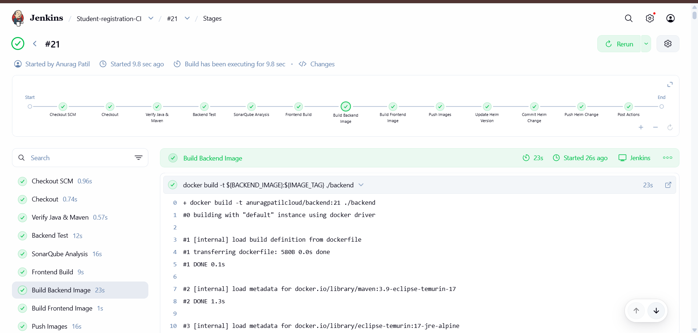 | 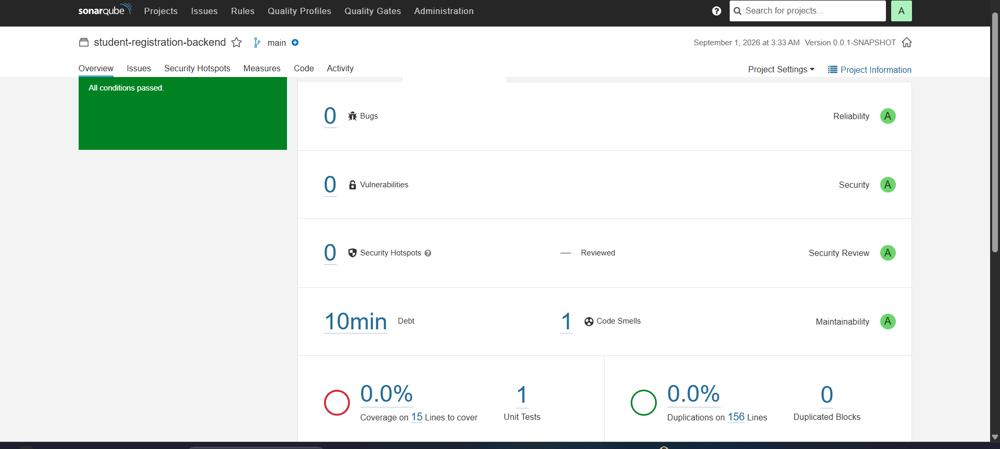 |

**Images pushed to Docker Hub** after a successful build:


**Helm chart auto-committed** back to GitHub by the pipeline:

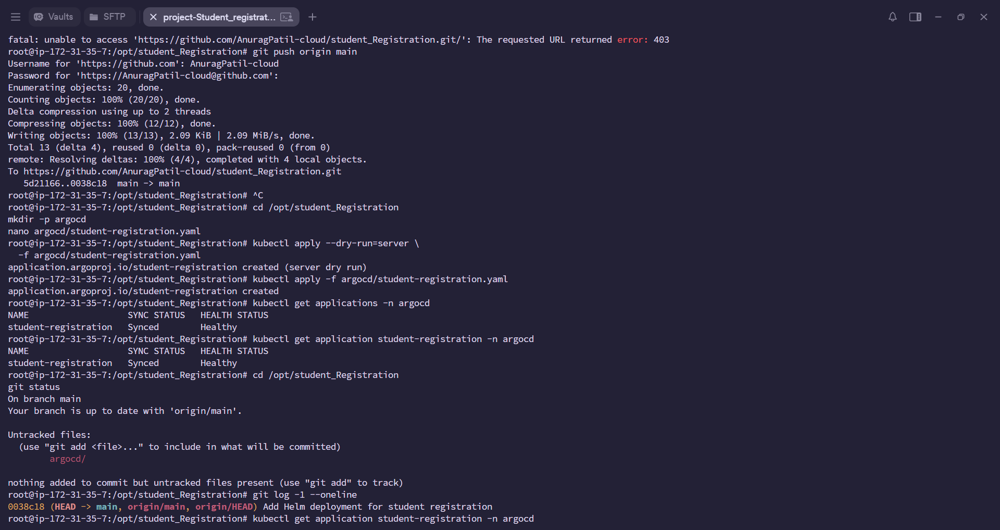

### Infrastructure (Terraform)

**`terraform plan` showing VPC, EKS, node group and RDS in sync:**

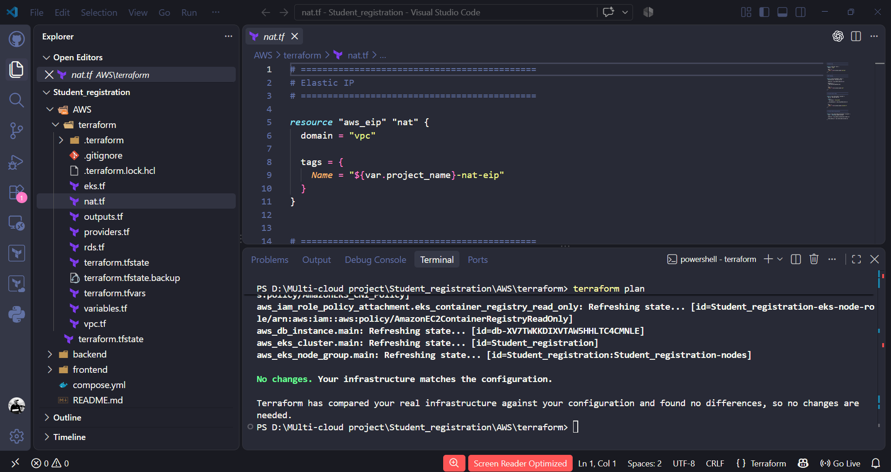

### Kubernetes Deployment (Helm on EKS)

**Helm install/upgrade, pods, services and ingress coming up:**

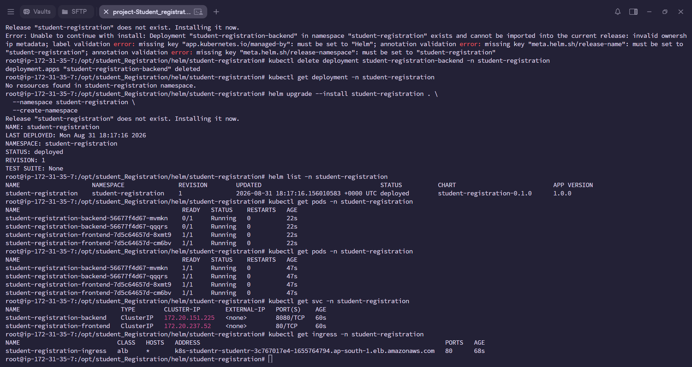

### Networking (ALB Ingress + DNS)

| ALB provisioned in AWS | ALB target health |
|---|---|
|  | 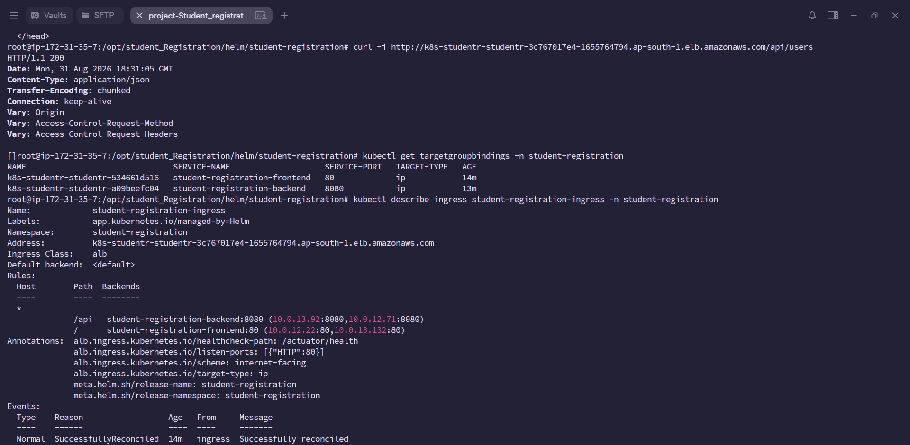 |

| Ingress controller events | EC2 DNS settings |
|---|---|
| 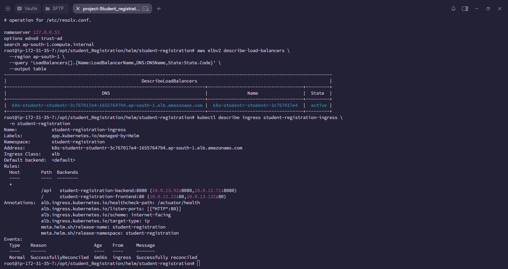 | 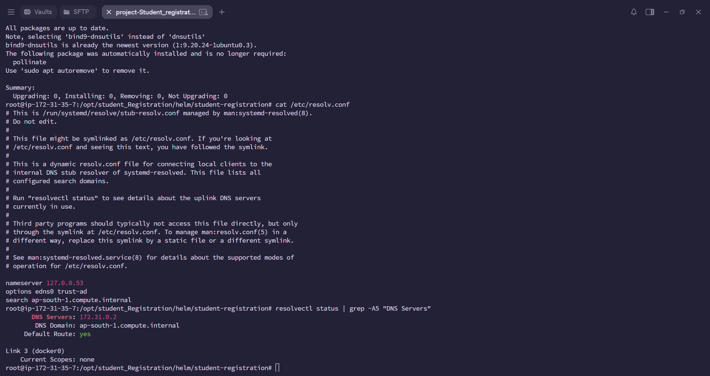 |

| `nslookup` resolving the ALB | DNS test from inside EC2 | `resolv.conf` |
|---|---|---|
| 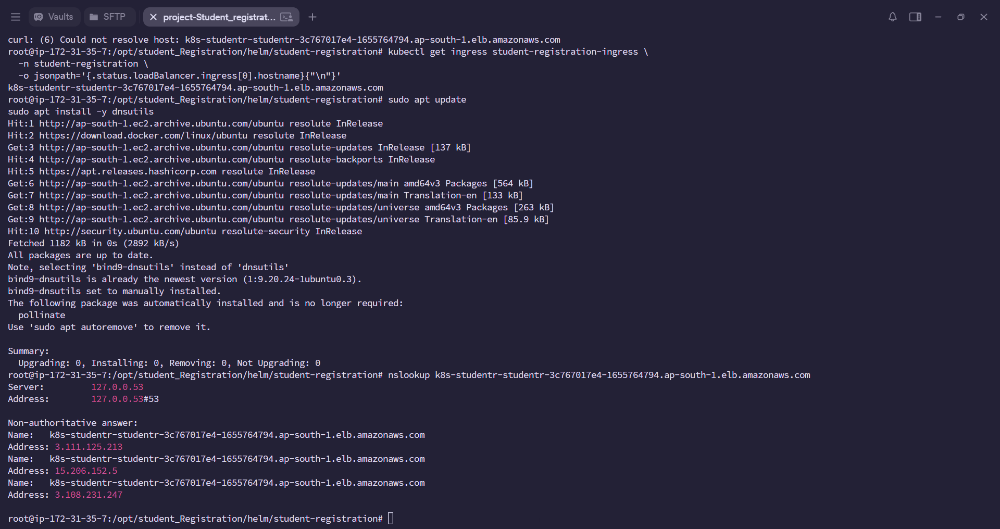 | 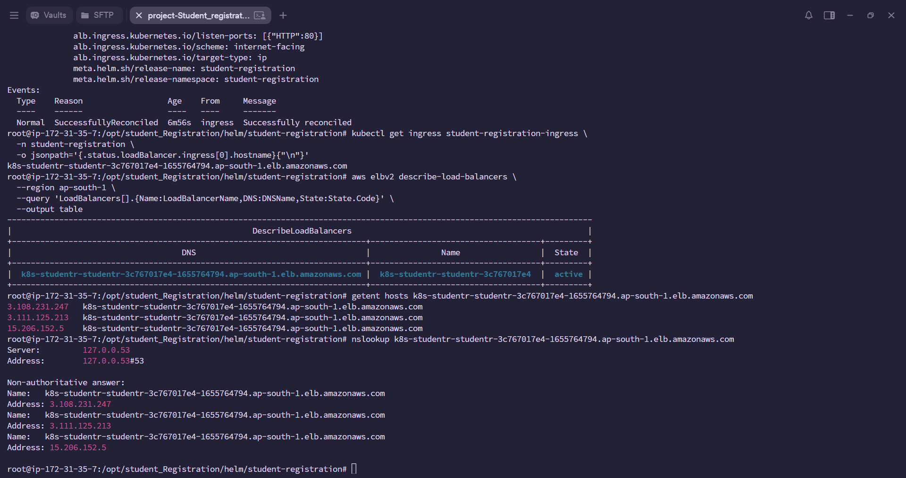 | 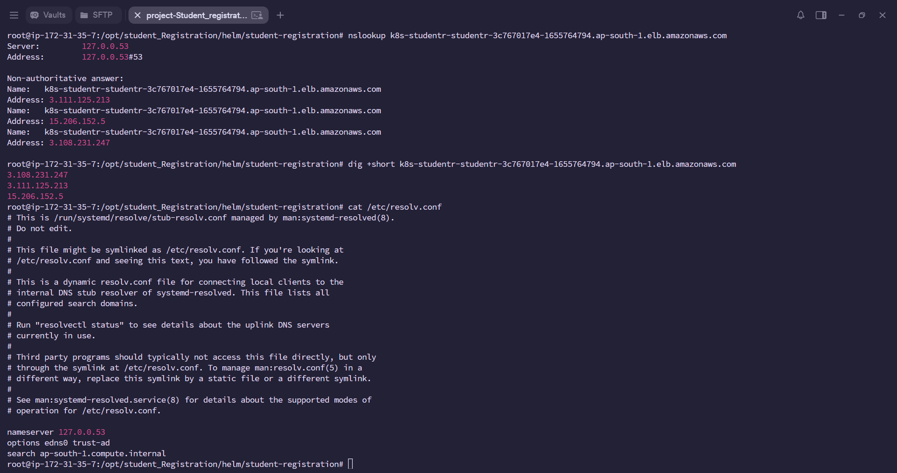 |

### Observability

| Cluster metrics (`kubectl top`) | CloudWatch Logs |
|---|---|
| 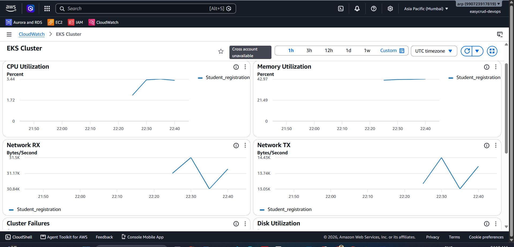 | 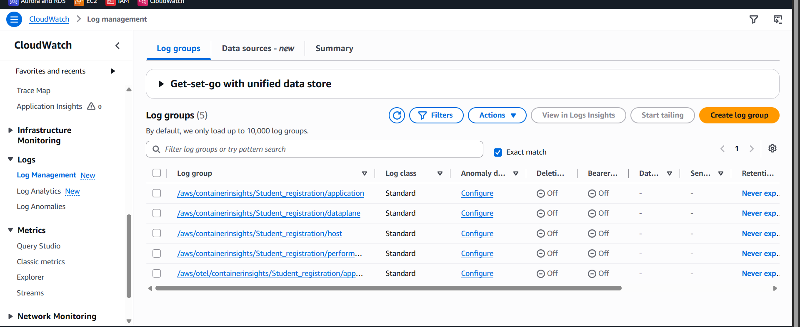 |

---

## 🚀 Getting Started Locally

### Prerequisites

- Docker & Docker Compose
- Node.js 18+ and npm (if running the frontend outside Docker)
- Java 17 + Maven (if running the backend outside Docker)
- A MariaDB instance (local or remote)

### Option 1 — Docker Compose (fastest)

```bash
git clone https://github.com/AnuragPatil-cloud/student_Registration.git
cd student_Registration

docker compose up --build
```

- Backend → `http://localhost:8080`
- Frontend → `http://localhost:80`

> Update `backend/src/main/resources/application.properties` with your MariaDB connection details before building, or point it at an already-running database.

### Option 2 — Run services manually

**Database** — see the MariaDB setup notes at the bottom of this README, or install MariaDB locally and create a `student_db` database.

**Backend**

```bash
cd backend
vim src/main/resources/application.properties   # set DB host/user/pass
mvn clean package
java -jar target/student-registration-backend-0.0.1-SNAPSHOT.jar
```

**Frontend**

```bash
cd frontend
vim .env   # VITE_API_URL="http://<backend-host>:8080/api"
npm install
npm run dev
```

---

## ☁️ Cloud Deployment

1. **Provision infrastructure**

   ```bash
   cd AWS/terraform
   terraform init
   terraform plan
   terraform apply
   ```

   This creates the VPC, EKS cluster + node group, RDS (MariaDB) instance, and the IAM roles/policies required by EKS.

2. **Deploy the app with Helm**

   ```bash
   helm upgrade --install student-registration ./helm/student-registration \
     --namespace student-registration \
     --create-namespace
   ```

3. **(Optional) Hand off to Argo CD for GitOps**

   ```bash
   kubectl apply -f argocd/student-registration.yaml
   ```

   From this point, any push to `helm/student-registration/values.yaml` (e.g. a new image tag from Jenkins) is automatically detected and synced to the cluster by Argo CD.

4. **Expose the app** — the Helm chart's `ingress.yaml` creates an ALB Ingress (`kubernetes.io/ingress.class: alb`, internet-facing). Once the AWS Load Balancer Controller provisions the ALB, the app is reachable at the ALB's DNS name.

---

## 🔑 Environment Variables

**Backend** — `backend/src/main/resources/application.properties`

| Variable | Description |
|---|---|
| `spring.datasource.url` | JDBC URL, e.g. `jdbc:mariadb://<DB_HOST>:3306/<DB_NAME>` |
| `spring.datasource.username` | Database username |
| `spring.datasource.password` | Database password |
| `server.port` | Port the Spring Boot app listens on (default `8080`) |

**Frontend** — `frontend/.env`

| Variable | Description |
|---|---|
| `VITE_API_URL` | Base URL of the backend API, e.g. `http://<BACKEND_HOST>:8080/api` |

---

## 🗄️ Database Setup (MariaDB)

```bash
# Install
apt update && apt install mariadb-server -y

# Secure the installation
mysql_secure_installation

# Create the database and user
mysql -u root -p
```

```sql
CREATE DATABASE student_db;
GRANT ALL PRIVILEGES ON student_db.* TO 'username'@'localhost' IDENTIFIED BY 'your_password';
EXIT;
```

You'll need the following to connect the backend to the database: `DB_HOST`, `DB_USER`, `DB_PASS`, `DB_PORT`, `DB_NAME`.

---

## 👤 Author

**Anurag Patil**
- Docker Hub: [anuragpatilcloud](https://hub.docker.com/u/anuragpatilcloud)
- GitHub: [AnuragPatil-cloud](https://github.com/AnuragPatil-cloud)

---


